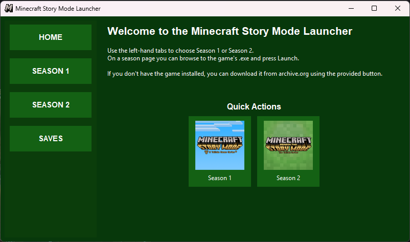
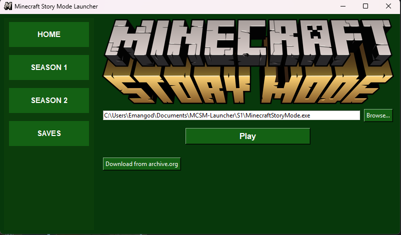
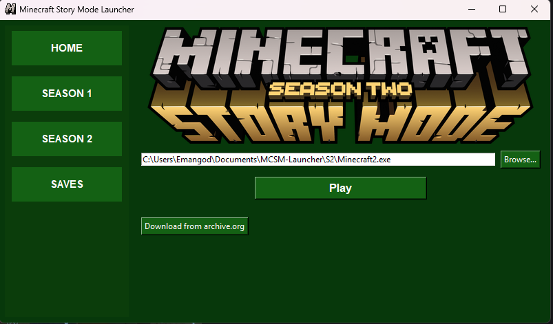
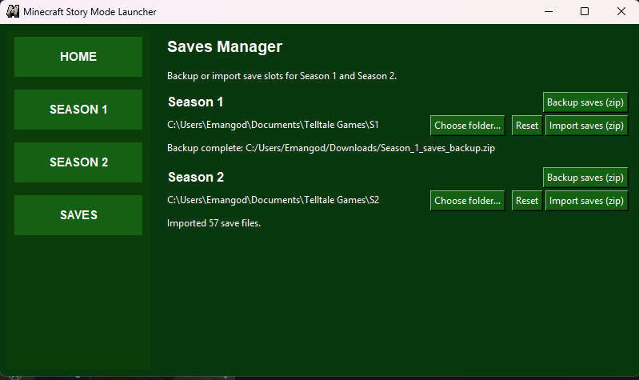

# Minecraft Story Mode Launcher (Python)

# [Download EXE Here](https://github.com/eman225511/MCSM-Launcher/releases)

| | |
| ------------- | ------------- |
|   |   |
|   |   |

This is a minimal GUI launcher for Minecraft Story Mode (Season 1 & Season 2).

Features (initial):
- Manual path selection for Season 1 and Season 2 executables.
- Launch button for each season.
- Simple config persistence in `launcher_config.json`.
- Optional logo images: place them in `assets/s1_logo.png` and `assets/s2_logo.png`.

How to run (Windows PowerShell):

1. Make sure you have Python 3.8+ installed and available on PATH.
2. (Optional) Install Pillow if you want extra image format support: `pip install pillow`.
3. From the project folder, run:

# Minecraft Story Mode Launcher (Python)

A small Tkinter-based launcher for Minecraft Story Mode (Seasons 1 & 2). The app
lets you point to the game executables, launch them, download archive.org
releases for each season, and manage save backups/imports.

This repository contains the source app (`launcher.py`), assets, and helper
tools used to build a single-file Windows executable.

## Features

- Vertical tab UI: Home / Season 1 / Season 2 / Saves
- Per-season executable path entry + prominent "Play" button
- "Download from archive.org" for each season (downloads + extracts ZIP)
- Segmented parallel download (when supported by server) with progress
- Saves manager: choose saves folder, backup saves to zip, import from zip (preserves folder structure)
- Config persistence (`launcher_config.json`) and image asset loading (Pillow optional)
- Build helper to produce a one-file Windows exe (PowerShell + PyInstaller)

## Requirements

- Python 3.8+ (3.12 used in development)
- Optional: Pillow for better image format handling (recommended)

Install optional deps:

```powershell
python -m pip install pillow
```

## Run from source (development)

From the repository root (PowerShell):

```powershell
python .\launcher.py
```

The app will create or update `launcher_config.json` in the repository root when
run from source.

## Build a single-file Windows exe

A PowerShell helper script `build_exe.ps1` is provided to convert the PNG icon
and run PyInstaller. Example (run from project root):

```powershell
# Use the project's virtualenv python if you have one
powershell -NoProfile -ExecutionPolicy Bypass -Command "& './build_exe.ps1' -PythonExe '.\.venv\Scripts\python.exe'"
```

What the script does:
- Installs PyInstaller and Pillow into the specified Python environment (if missing)
- Converts `assets/Logo.png` into an .ico for the Windows exe icon
- Runs PyInstaller with `--onefile` and bundles the `assets/` folder

After a successful build you'll find the single-file exe in the `dist\` folder.

## Assets

Place optional images in the `assets/` directory:

- `Logo.png` — app/window icon (used at runtime; converted to .ico for the exe)
- `S1logo.png`, `S2logo.png` — large banner images shown on each season page
- `S1icon.png`, `S2icon.png` — icons used on the Home quick action buttons

If Pillow is installed the app will use it to resize images more smoothly. If
Pillow is not available, Tk's PhotoImage will be used as a fallback.

## Downloads (archive.org)

Each season page has a "Download from archive.org" button. The app will:

- Ask whether to use the default install folder (developer mode: next to the
	app; bundled exe: `%USERPROFILE%\Documents\MCSM-Launcher\S1` or `S2`).
- Create the chosen folder if it doesn't exist and download the ZIP.
- Attempt a parallel ranged download (HTTP Range) to speed up transfers when
	the server supports it; otherwise fall back to a single-stream download.
- Extract the ZIP and attempt to find the expected executable (`MinecraftStoryMode.exe` for S1 and `Minecraft2.exe` for S2).

Special handling for Season 2: some archive ZIPs contain a nested layout like

```
S2\Minecraft.Story.Mode.Season.Two\Minecraft Story Mode Season Two\...
```

The app will detect this pattern and move the files from the inner "Minecraft
Story Mode Season Two" folder up into the chosen `S2` install folder so the
game files are not buried several levels deep.

## Saves manager

The Saves tab lets you:

- Choose a saves folder (persisted to config)
- Backup all files under that folder to a zip (preserves directory structure)
- Import a zip (extract to a temporary folder, show overwrite detection, then copy files preserving relative paths)

Import and backup preserve relative paths so folder structure is retained.

## Troubleshooting

- If the exe's icon doesn't appear after building, confirm `build\Logo.ico`
	exists and that `build_exe.ps1` completed without errors.
- If downloads appear to complete but nothing is installed, check the
	selected install folder in the dialog — when running the one-file exe the
	default is a Documents subfolder to avoid using the temporary extraction
	directory.

## Contributing

Contributions and bug reports are welcome. Please open issues or pull
requests on the GitHub repository.

## License

This project includes helper code and convenience scripts. License this repo
as you prefer (no license file is included by default).
